# Sentinel Parsing DSL (v2) — 열린 파싱 구조

현재 v1 (`FieldSpec` + `tagged_*`)은 LCP TLV 반복에 편하지만 **경계·반복·길이 의미가 코드에 고정**되어 있다.  
v2 DSL은 **작은 combinator + 표현식 + wire program**으로 어떤 바이너리 레이아웃도 기술할 수 있는 **열린 구조**를 목표로 한다.

- v1 (현재 구현): [`protocol-parsing.md`](./protocol-parsing.md)
- v2 (본 문서): 설계 명세. 구현 전이라도 스키마 작성·리뷰 가능.

> 다이어그램은 **Mermaid** 사용. ASCII 박스는 한글 폭 문제로 사용하지 않는다.

---

## 1. 설계 원칙

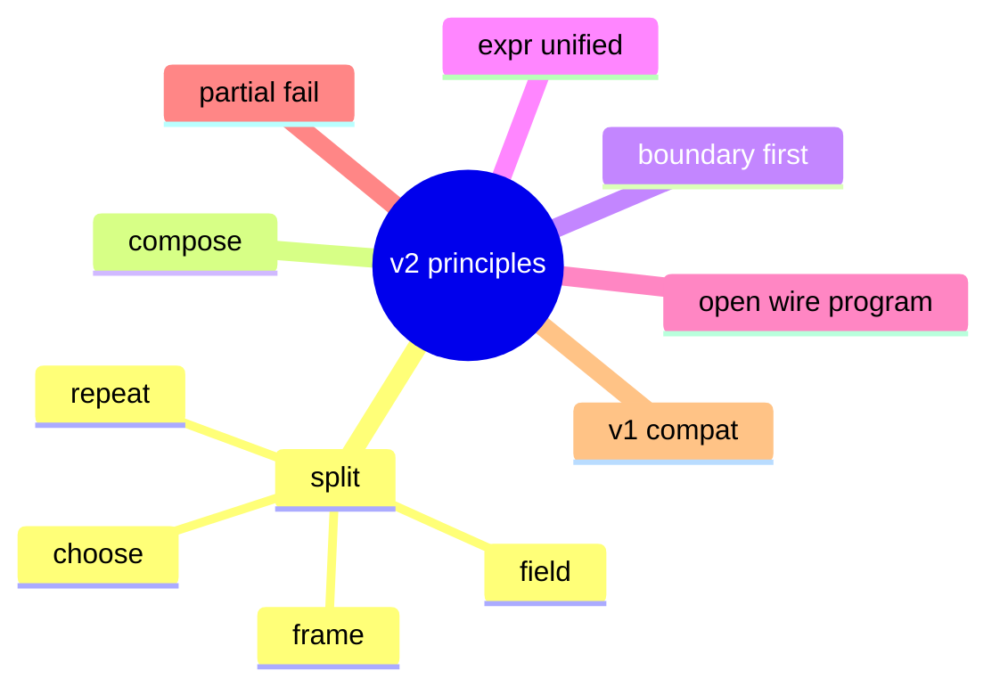

| 원칙 | 설명 |
|------|------|
| **분리** | *경계(frame)* · *반복(repeat)* · *분기(choose)* · *디코드(field)* 를 독립 primitive로 |
| **조합** | primitive만으로 새 프로토콜 표현. monolithic `tagged_repeat` 같은 특수 타입 최소화 |
| **경계 우선** | 모든 하위 파싱은 **컨테이너 슬라이스** 안에서만. 넘치면 명시적 정책 |
| **표현식** | 길이·횟수·조건·skip을 **동일 expr 언어**로 |
| **열림** | 표준 combinator로 안 되면 `wire` program 또는 `decoder` registry |
| **점진적 실패** | `on_error` / `mode: partial` 로 best-effort 파싱 |
| **호환** | v1 `FieldSpec` → v2 `Node` 자동 desugar |

---

## 2. 런타임 모델

### 2.1 Container stack

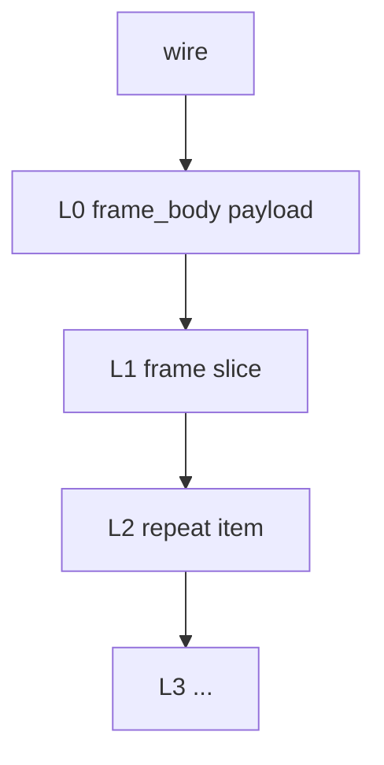

- 각 `frame` / `slice` / `repeat` item이 **새 슬라이스**를 push.
- pop 시 cursor는 **부모 컨테이너**로 복귀 (소비한 바이트만큼 advance).

### 2.2 Cursor

| 필드 | 의미 |
|------|------|
| `byte_off` | 컨테이너 로컬 바이트 위치 |
| `bit_off` | 바이트 내 비트 (0–7) |
| `bound_end` | `len(container)` exclusive |

### 2.3 Scope (바인딩 환경)

필드/`wire` step이 `bind`한 이름 + 내장 변수:

| 이름 | 의미 |
|------|------|
| `_container_len` | 현재 컨테이너 바이트 수 |
| `_remaining` | `bound_end - byte_off` (정렬 후) |
| `_cursor` | `byte_off` |
| `_parent.*` | 부모 scope (선택) |
| 임의 `bind` | `function_id`, `flag`, `block_len` … |

expr는 scope에서 lookup. 없으면 에러 (또는 `default`).

---

## 3. 가변 길이 · 블록 경계 · 중첩 반복

### 3.1 요구조건 (REQ)

| ID | 요구 |
|----|------|
| **REQ-LEN-01** | 길이(`len`) 필드는 **블록 안 어디에든** 올 수 있다 (항상 맨 앞 TLV일 필요 없음). |
| **REQ-LEN-02** | 같은 `len` 바이트 값도 **의미(semantics)** 를 스키마로 선택한다 (body만 / 블록 전체 / len 이후 등). |
| **REQ-LEN-03** | `len`으로 경계가 정해지면, **그 블록 안** 필드만 파싱하고 밖으로 넘지 않는다. |
| **REQ-LEN-04** | 필드 길이는 `fixed` · `remaining` · **expr** (`block_len - 2` 등) 로 표현한다. |
| **REQ-REP-01** | **반복(`repeat`)은 중첩** 가능하다 (repeat 안에 frame, frame 안에 repeat …). |
| **REQ-REP-02** | 반복 종료는 `count` · `container_end` · `expr` · `no_matching` 등 **독립 옵션**. |
| **REQ-REP-03** | 바깥 블록 `len`이 잘라 준 컨테이너 **안에서만** 안쪽 repeat가 동작한다. |

### 3.2 그림으로 본 FC / FA (사용자 스펙)

**바깥 FC 블록** — `len` = FLAG부터 블록 끝까지 (self)

| 순서 | 필드 | 비고 |
|------|------|------|
| 1 | FLAG `FC` | 구분자 |
| 2 | **len** | **블록 전체** 바이트 수 (self) |
| 3 | function_id | 1B |
| 4 | arg_count | 인자 개수 |
| 5.. | FA × N | 아래 블록 반복 |

**안쪽 FA 블록** — `len` = FA부터 다음 FA 전까지 (self)

| 순서 | 필드 | 비고 |
|------|------|------|
| 1 | FLAG `FA` | |
| 2 | **len** | **FA 블록 전체** (self) |
| 3 | value | **expr: `block_len - 2`** (FLAG+len 제외) |

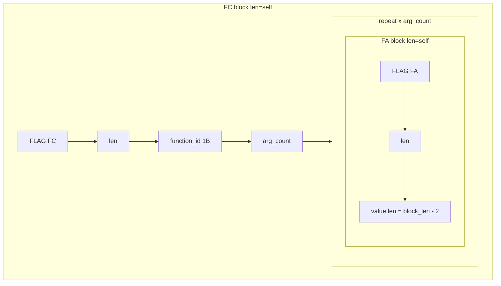

### 3.3 핵심 아이디어: 두 종류의 “길이”

혼동하지 않도록 **블록 경계 len** 과 **필드 소비 길이** 를 나눈다.

| 종류 | 역할 | 예 |
|------|------|-----|
| **블록 len** (`len_field`) | 상자 테두리를 자른다 | FC `len=0x0B`, FA `len=0x05` |
| **필드 length** (`field.length`) | 이미 잘린 상자 **안에서** 몇 바이트 읽을지 | `value`: `block_len - 2` |

```
1) len_field 읽음 → scope.block_len = L
2) semantics에 따라 컨테이너 슬라이스 확정
3) seq / repeat / field 는 그 슬라이스 안에서만 동작
4) value 필드는 length.expr 로 tail 크기 계산
```

### 3.4 `len` 필드 위치가 달라도 되는 이유 — **bounded seq**

v1 `tagged_*`는 **FLAG → len → body** 순서가 코드에 고정되어 있다.  
v2는 **`bounded` seq** 로 블록을 정의한다: **필드를 순서대로 읽다가 `len_field`를 만나면 경계 확정**.

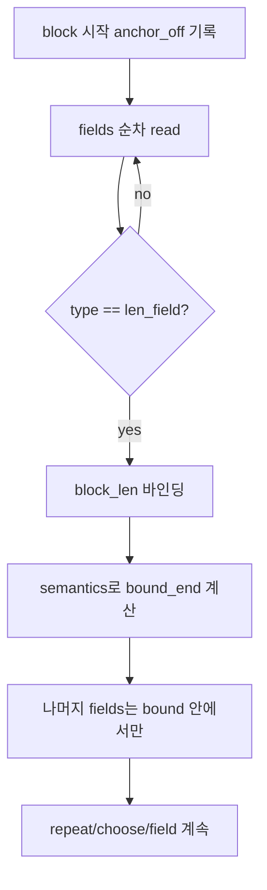

**`len`이 블록 중간에 있어도 됨** — 앞 필드는 `len` 읽기 전에 파싱, `len` 이후 필드는 확정된 bound 안에서 파싱.

**`len`이 블록 맨 앞에 있어도 됨** — `frame(tlv_self)` preset과 동일.

### 3.5 `len_field` 타입 (길이를 지원하는 필드)

일반 `field`와 별도. **정수를 읽고 경계를 선언**한다.

```json
{
  "type": "len_field",
  "name": "block_len",
  "codec": "u8",
  "bind": "block_len",
  "semantics": "self_from_anchor",
  "anchor": "block_start"
}
```

#### `semantics` (블록 len 의미)

| semantics | bound 계산 | LCP 예 |
|-----------|------------|--------|
| `body_after_len` | len 바이트 **다음부터** L바이트 (v1 tagged) | — |
| `self_from_anchor` | `anchor_off` 부터 **L바이트 전체** | FC, FA |
| `self_from_here` | **len 필드 포함** 현재 위치부터 L바이트 | 변형 TLV |
| `to_container_end` | len 무시, 부모 컨테이너 끝까지 | (검증용) |
| `expr` | `{ "expr": "..." }` 로 bound_end 직접 | 확장 |

`anchor`는 보통 블록 첫 바이트(FLAG) 오프셋. FLAG 앞에 prefix가 있으면 `anchor: "seq_start"`.

### 3.6 필드 `length` (블록 **안** 가변 크기)

`len_field`로 상자를 자른 **뒤**, 각 leaf는:

```json
{
  "type": "field",
  "name": "value",
  "codec": "bytes",
  "length": { "mode": "expr", "expr": "block_len - 2" }
}
```

| mode | 용도 |
|------|------|
| `fixed` | 고정 N바이트 |
| `remaining` | 컨테이너 tail 전부 |
| `expr` | scope 변수로 N 계산 |

expr에서 쓸 수 있는 값: `block_len`, `_container_len`, `_remaining`, `arg_count`, 앞 필드 `bind` 이름.

### 3.7 타입 구성 요약 (v2)

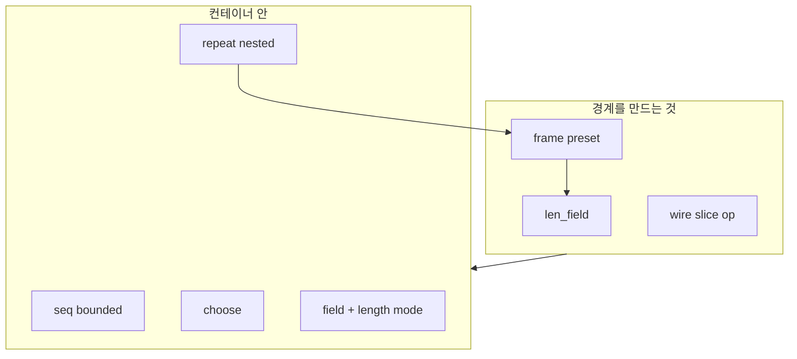

| type | 역할 |
|------|------|
| **`len_field`** | 블록 len 읽기 + semantics로 **컨테이너 push** |
| **`bounded` / `seq`** | anchor + fields[] + (선택) bound 검증 |
| **`frame`** | FLAG/len 위치가 고정일 때 `len_field`+`seq` **shortcut** |
| **`repeat`** | item 스키마를 N회 또는 until — **중첩 가능** |
| **`field`** | leaf; `length.mode` = fixed / remaining / expr |
| **`choose`** | 분기 |
| **`wire[]`** | len 위치가 특수할 때 단계별 read/slice |

### 3.8 중첩 repeat 규칙

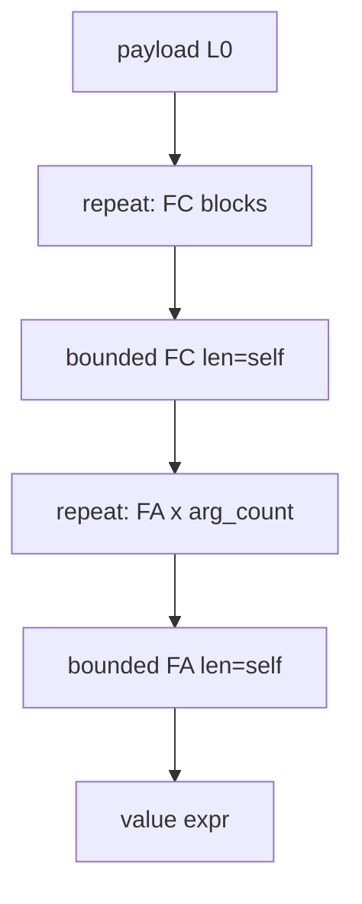

- 각 repeat의 **item**은 `bounded` 또는 `frame` — 한 iteration마다 **자기 len**으로 슬라이스.
- **안쪽 repeat**는 **바깥 bounded**가 준 bound를 넘지 않음.
- `arg_count` repeat와 `container_end` repeat **혼용 가능** (먼저 도달하는 조건 stop).

### 3.9 CF 스키마 골격 (v2 JSON)

```json
{
  "type": "repeat",
  "name": "functions",
  "until": "container_end",
  "item": {
    "type": "bounded",
    "anchor": "block_start",
    "fields": [
      { "type": "field", "name": "flag", "codec": "u8", "bind": "flag" },
      { "type": "len_field", "codec": "u8", "bind": "block_len", "semantics": "self_from_anchor" },
      { "type": "field", "name": "function_id", "codec": "u8" },
      { "type": "field", "name": "arg_count", "codec": "u8", "bind": "arg_count" },
      {
        "type": "repeat",
        "name": "arguments",
        "count": { "expr": "arg_count" },
        "item": {
          "type": "bounded",
          "fields": [
            { "type": "field", "codec": "u8", "bind": "flag" },
            { "type": "len_field", "codec": "u8", "bind": "block_len", "semantics": "self_from_anchor" },
            { "type": "field", "name": "value", "codec": "bytes",
              "length": { "mode": "expr", "expr": "block_len - 2" } }
          ]
        }
      }
    ]
  }
}
```

### 3.10 v1과 차이 (한 줄)

| v1 | v2 |
|----|-----|
| len 위치 = FLAG 다음 1B 고정 | **len_field 위치 = fields 순서** |
| len = body only 고정 | **semantics 선택** |
| `tagged_repeat` = 경계+반복 일체 | **`len_field` + `bounded` + `repeat` 분리** |
| repeat 중첩 = 사실상 body 안에서만 | **repeat 명시적 중첩** |

---

## 4. 표현식 (Expr)

v1 `decoration`과 **동일 tokenizer/parser** 확장. 정수 결과.

### 3.1 연산

`+` `-` `*` `/` `%` `()` 비교 (`==` `!=` `<` `>` `<=` `>=`) 논리 (`&&` `||` `!`)

### 3.2 식별자

scope 변수, 10진 리터럴, `0x` hex 리터럴.

### 3.3 내장 함수 (확장 포인트)

| 함수 | 설명 |
|------|------|
| `len(x)` | 바인딩된 blob/hex 길이 |
| `min(a,b)` `max(a,b)` | |
| `hex(n, w)` | n을 w자리 hex (dispatch 키용) |

### 3.4 사용처

- `length.expr` — 필드 길이
- `frame.body_len.expr` — sub-container 크기
- `repeat.count.expr` — 반복 횟수
- `repeat.until.expr` — 종료 조건 (truthy)
- `choose.when.expr` — 분기 조건
- `if.present` / `skip.when`

---

## 5. Node 스키마 (v2 루트)

```json
{
  "schema_version": 2,
  "name": "payload",
  "type": "seq",
  "fields": [ "...nodes..." ]
}
```

모든 노드는 `"type"` discriminant. 공통 optional:

```json
{
  "name": "result_key",
  "bind": "scope_name",
  "when": { "expr": "arg_count > 0" },
  "on_error": "fail | skip | raw | partial",
  "doc": "human note"
}
```

---

## 6. Combinator catalog

### 5.1 `seq` — 순차 (v1 `struct`)

```json
{
  "type": "seq",
  "name": "header",
  "fields": [
    { "type": "field", "name": "version", "codec": "u8" },
    { "type": "field", "name": "flags", "codec": "u8" }
  ]
}
```

결과: `{ "header": { "version": 1, "flags": 0 } }` 또는 flatten 옵션.

---

### 5.2 `field` — leaf 디코드

```json
{
  "type": "field",
  "name": "temperature",
  "codec": "f32",
  "length": { "mode": "fixed", "value": 4 },
  "endian": "le",
  "bit": { "offset": 0, "length": 3 },
  "length": { "mode": "expr", "expr": "block_len - 2" },
  "length": { "mode": "remaining" }
}
```

#### `length.mode`

| mode | 동작 |
|------|------|
| `fixed` | `value` 바이트 |
| `remaining` | 컨테이너 끝까지 |
| `expr` | expr → N 바이트 |

#### `codec`

`u8` `i8` `u16` `i16` `u32` `i32` `f32` `f64` `ascii` `hex` `bytes`  
+ registry: `"codec": { "id": "custom.crc_status" }`

---

### 5.3 `frame` — 경계(컨테이너) 생성

**반복·분기와 분리된 핵심 primitive.** 한 덩어리 wire를 읽어 **sub-container** push.

#### Preset layouts (`frame.layout`)

| layout | wire | body_len 의미 |
|--------|------|----------------|
| `tlv_body` | tag + len + body | len = body only (v1 tagged) |
| `tlv_self` | tag + len + ... | len = tag부터 블록 끝 (FA self) |
| `lv_body` | len + body | tag 없음 |
| `fixed` | N bytes | frame.size.expr |
| `custom` | wire[] program | §6 |

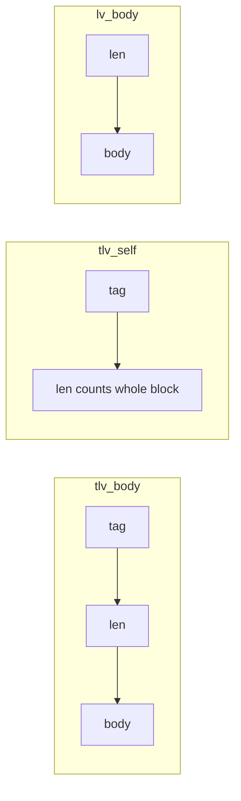

#### 예: v1 tagged (tlv_body)

```json
{
  "type": "frame",
  "name": "argument",
  "layout": "tlv_body",
  "tag": { "bytes": 1, "bind": "flag" },
  "length": { "bytes": 1, "bind": "block_len", "semantics": "body" },
  "body": {
    "type": "seq",
    "fields": [
      { "type": "field", "name": "value", "codec": "bytes",
        "length": { "mode": "expr", "expr": "block_len" } }
    ]
  }
}
```

#### 예: FA self-inclusive

```json
{
  "type": "frame",
  "layout": "tlv_self",
  "tag": { "bytes": 1, "bind": "flag", "expect": "FA" },
  "length": { "bytes": 1, "bind": "block_len" },
  "body": {
    "type": "seq",
    "fields": [
      {
        "type": "field", "name": "value", "codec": "bytes",
        "length": { "mode": "expr", "expr": "block_len - 2" }
      }
    ]
  }
}
```

`tlv_self` 파싱 흐름:

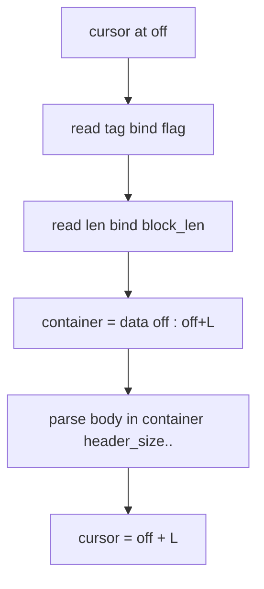

`header_size`, `tag.bytes`, `length.bytes` 모두 스키마로 override.

---

### 5.4 `repeat` — 반복

```json
{
  "type": "repeat",
  "name": "arguments",
  "item": { "type": "frame", "layout": "tlv_self", "...": "..." },
  "until": "container_end",
  "count": { "expr": "arg_count" },
  "max": 256,
  "on_empty": "ok"
}
```

#### `until`

| until | 동작 |
|-------|------|
| `container_end` | `_remaining == 0` |
| `count` | `count.expr` 회만 (scope/count 필드) |
| `expr` | expr truthy 때 종료 **전**까지 |
| `no_matching` | item frame tag 불일치 시 stop (v1 tagged_until) |
| `delimiter` | `delimiter.bytes` / `delimiter.expr` |

`count`와 `container_end` 동시: **먼저 도달하는 쪽** stop (안전).

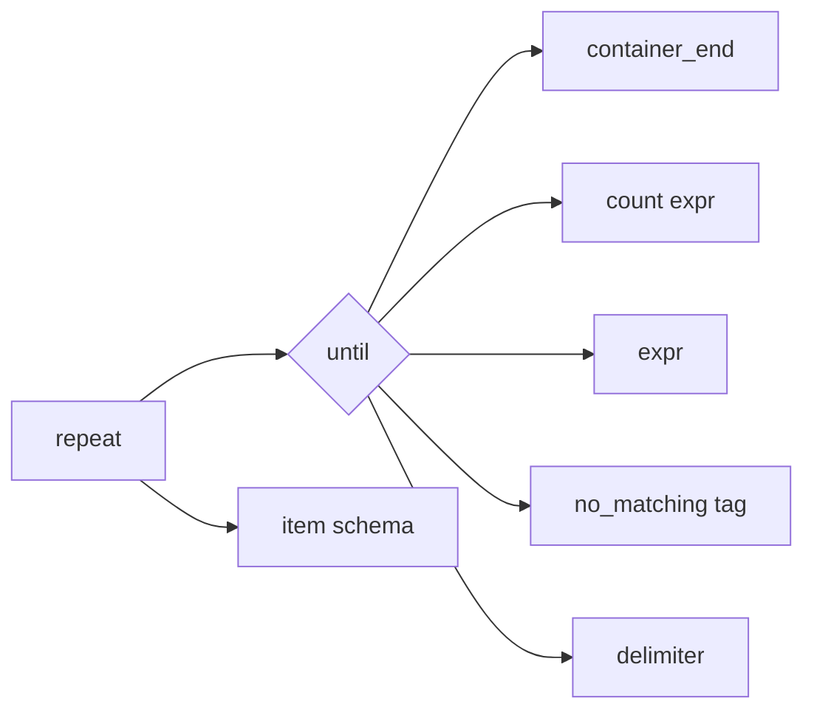

### 5.5 `choose` — 분기 (v1 `dispatch`)

```json
{
  "type": "choose",
  "name": "value",
  "on": { "expr": "type_id" },
  "cases": {
    "0x01": { "type": "field", "codec": "u16", "endian": "le" },
    "0x02": { "type": "field", "codec": "f32", "endian": "le" }
  },
  "default": {
    "type": "field", "codec": "bytes",
    "length": { "mode": "remaining" }
  }
}
```

- `on.expr` 또는 `on.bind` (scope 키)
- case 키: hex / decimal 문자열, normalize 규칙 v1과 동일
- `choose` / `cases[]` 배열 + `when.expr` 도 허용 (순서 평가)

---

### 5.6 `pad` / `skip`

```json
{ "type": "skip", "length": { "mode": "expr", "expr": "4" } }
{ "type": "align", "to": 4 }
```

---

### 5.7 `assert` / `verify`

```json
{
  "type": "assert",
  "that": { "expr": "arg_count == len(arguments)" },
  "on_fail": "warn | fail"
}
```

검증만, cursor 이동 없음.

---

### 5.8 `ref` — 스키마 재사용

```json
{ "type": "ref", "schema": "preset://lcp/fa_argument" }
```

프리셋 / `$defs` 로 fragment 공유.

---

## 7. Wire program (최대 열림 — escape hatch)

`frame.layout: "custom"` 일 때 `wire` step 배열:

```json
{
  "type": "frame",
  "layout": "custom",
  "wire": [
    { "op": "read", "bind": "flag", "bytes": 1 },
    { "op": "read", "bind": "len_lo", "bytes": 1 },
    { "op": "read", "bind": "len_hi", "bytes": 1, "when": { "expr": "flag == 0xFC" } },
    { "op": "let", "bind": "body_len", "expr": "len_lo + (len_hi << 8) - 2" },
    { "op": "slice", "bind": "_body", "length": { "expr": "body_len" } },
    { "op": "parse", "target": "_body", "schema": { "type": "seq", "fields": ["..."] } }
  ]
}
```

### Wire ops (확장 가능 registry)

| op | 설명 |
|----|------|
| `read` | N bytes → bind (raw bytes / integer codec) |
| `slice` | 현재 cursor에서 N bytes sub-container → bind |
| `slice_from` | 절대 off (container-local) |
| `let` | expr → bind |
| `parse` | bind blob을 sub-schema로 parse |
| `seek` | cursor += expr |
| `align` | padding |
| `peek` | cursor 유지 read |
| `match` | bytes pattern or fail/skip |

**새 프로토콜 = 새 wire program.** combinator 조합으로 부족할 때만 사용.

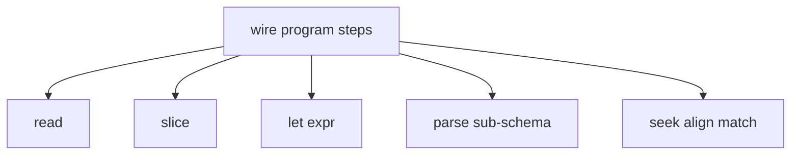

## 8. Extension registry (열린 디코더)

```json
{
  "type": "field",
  "codec": { "id": "sentinel.crc16_ccitt", "args": { "poly": "0x1021" } }
}
```

| 등록 종류 | 예 |
|-----------|-----|
| `codec.*` | custom integer, BCD, UTF-16 |
| `frame.layout.*` | preset wire |
| `wire.op.*` | domain-specific step |
| `checksum.*` | CRC, XOR |

Unknown codec → `on_error: raw` 시 hex fallback.

---

## 9. 파싱 정책

### 8.1 `on_error` (노드별)

| 값 | 동작 |
|----|------|
| `fail` | 전체 중단 (default) |
| `skip` | 해당 노드 skip, cursor 정책에 따라 |
| `raw` | 남은 container → hex `*_raw` |
| `partial` | 지금까지 결과 유지, tree에 `*_error` |

### 8.2 Parse mode (전역)

| mode | 설명 |
|------|------|
| `strict` | 모든 assert/on_error=fail |
| `lenient` | default → raw |
| `inspect` | 소비 offset map, 미파싱 구간 highlight |

---

## 10. v1 → v2 desugar (호환)

| v1 | v2 |
|----|-----|
| `struct` | `seq` |
| `dispatch` | `choose` |
| `tagged_repeat` | `repeat` + `item: frame(tlv_body)` + `until: no_matching` |
| `tagged_block` | `frame(tlv_body)` ×1 |
| `length_mode: remaining` | `length.mode: remaining` |
| `function_args` | desugar → tagged_repeat |
| `FieldSpec[]` in FIDPayload | `Node` tree or auto-convert at load |

로더가 v1 스키마를 v2 AST로 변환 → **기존 프리셋 유지**.

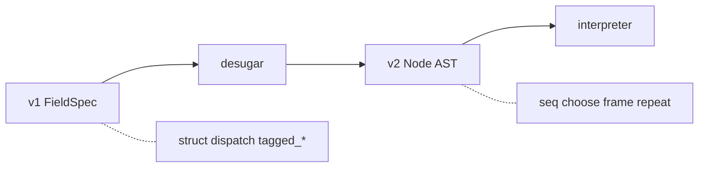

## 11. 예시 — Multi-Function RPC (수정된 CF)

```json
{
  "schema_version": 2,
  "type": "repeat",
  "name": "functions",
  "until": "container_end",
  "item": {
    "type": "frame",
    "layout": "tlv_body",
    "tag": { "bytes": 1, "bind": "flag", "expect": "FC" },
    "length": { "bytes": 1, "bind": "block_len", "semantics": "body" },
    "body": {
      "type": "seq",
      "fields": [
        { "type": "field", "name": "function_id", "codec": "u8", "bind": "function_id" },
        { "type": "field", "name": "arg_count", "codec": "u8", "bind": "arg_count" },
        {
          "type": "repeat",
          "name": "arguments",
          "count": { "expr": "arg_count" },
          "until": "count",
          "item": {
            "type": "frame",
            "layout": "tlv_self",
            "tag": { "bytes": 1, "bind": "flag", "expect": "FA" },
            "length": { "bytes": 1, "bind": "block_len" },
            "body": {
              "type": "field",
              "name": "value",
              "codec": "bytes",
              "length": { "mode": "expr", "expr": "block_len - 2" }
            }
          }
        }
      ]
    }
  }
}
```

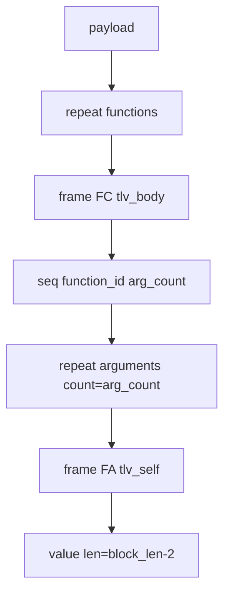

---

## 12. 예시 — v1으로 불가능했던 케이스

### 11.1 2-byte length TLV

```json
{
  "type": "frame",
  "layout": "custom",
  "wire": [
    { "op": "read", "bind": "tag", "bytes": 1 },
    { "op": "read", "bind": "block_len", "codec": "u16", "endian": "be" },
    { "op": "slice", "bind": "body", "length": { "expr": "block_len" } },
    { "op": "parse", "target": "body", "schema": { "type": "seq", "fields": [] } }
  ]
}
```

### 11.2 count 없이 delimiter까지

```json
{
  "type": "repeat",
  "until": "delimiter",
  "delimiter": { "bytes": "00" },
  "item": { "type": "field", "codec": "u8" }
}
```

### 11.3 비트 + dispatch + repeat 중첩

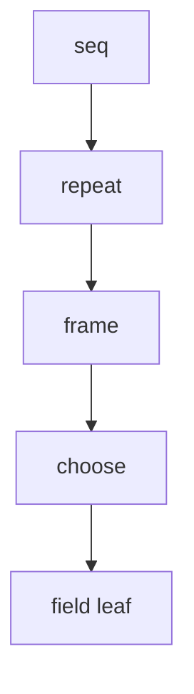

임의 깊이: `seq` → `repeat` → `frame` → `choose` → `field` …

---

## 13. 아키텍처 (구현 시)

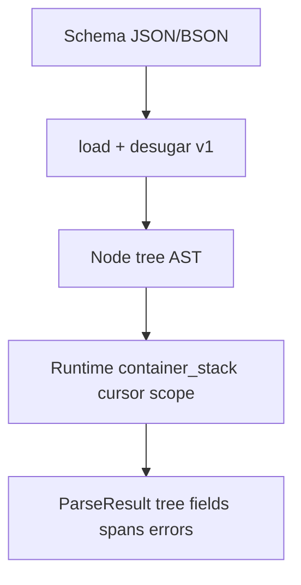

- **Interpreter** 하나. 프로토콜별 코드 없음.
- **Span map**: 각 필드의 `[start,end)` wire offset (UI hex highlight).
- Backend / Dashboard **동일 AST + 동일 interpreter spec** (TS/Go dual impl or WASM).

---

## 14. 구현 로드맵 (제안)

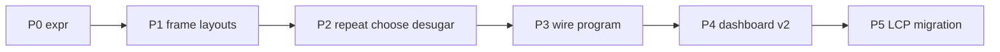

| Phase | 내용 |
|-------|------|
| P0 | Expr evaluator 공유 (`length`, `when`, `count`) |
| P1 | `frame` layouts: `tlv_body`, `tlv_self`, `lv_body`, `fixed` |
| P2 | `repeat` + `choose` + v1 desugar |
| P3 | `wire` program + registry |
| P4 | Dashboard schema editor v2 + span UI |
| P5 | v1 deprecated, LCP preset v2 migration |

---

## 15. 한 줄 요약

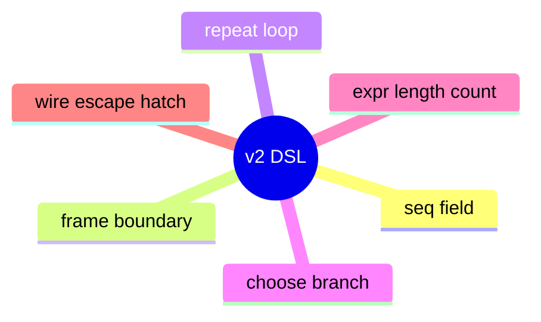

> **v2 = `seq` + `field` + `frame`(경계) + `repeat`(반복) + `choose`(분기) + `expr`(길이/조건) + `wire`(만능)**  
> monolithic TLV 타입 대신 **조합 가능한 열린 AST**로, 아직 정의되지 않은 wire도 스키마(또는 wire program)만 추가하면 파싱한다.

관련: [`protocol-parsing.md`](./protocol-parsing.md) (v1 현행), [`requirements.md`](../requirements.md)
