# Sentinel 프로토콜 파싱 규칙

Sentinel은 프로토콜별 파서 코드를 두지 않고, **`FieldSpec` 스키마(JSON)** 를 해석하는 범용 파서를 사용한다.  
구현 위치:

| 계층 | Backend (Go) | Frontend (TypeScript) |
|------|--------------|------------------------|
| 진입점 | `backend/internal/protocol/parser.go` | `dashboard/src/lib/compositors.ts` 등 |
| 프레임 | `backend/internal/protocol/frame.go` | — |
| 필드/combinator | `backend/internal/protocol/compositors.go`, `fields.go`, `bounds.go`, `bits.go` | `dashboard/src/lib/compositors.ts`, `bounds.ts`, `bits.ts` |

Backend와 Dashboard는 동일한 규칙을 따르도록 구현되어 있다.

---

## 0. 영역 다이어그램 (시각 참고)

문서 전체에서 쓰는 **영역(container)**, **cursor**, **scope** 관계를 아래에서 설명한다.

### 0.1 전체 바이트 스트림 — Frame Envelope

**Wire byte 배치 (표)**

| 순서 | 구간 | 예시 필드 | 비고 |
|------|------|-----------|------|
| 1 | START | `AA` | 고정 1B |
| 2 | header | `LN`, `FID`, `SEQ`, `ATTR` | `frame_def.header[]` 순차 파싱 |
| 3 | payload | CF/CD body | FID별 스키마 = **컨테이너 L1** |
| 4 | tail | `CRC16` | payload와 분리 |
| 5 | END | `BB` | 고정 1B |

`frame_body` = START·END를 뺀 가운데 (header + payload + tail).

**LN(length) 규칙:** header의 length 값이 `header_end < LN <= len(frame_body)`이면 payload 끝 = LN 오프셋.

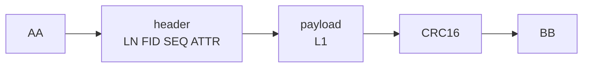

위 그림은 **논리 순서**만 표시한다. 실제 크기는 LN·FID별 payload 길이에 따라 가변이다.

| 이름 | 무엇인가 |
|------|----------|
| **frame_body** | START(AA)와 END(BB)를 뺀 가운데 구간 |
| **header** | `frame_def.header[]`로 순차 파싱 |
| **payload** | FID별 `FieldSpec[]`가 파싱하는 **최상위 컨테이너** |
| **tail** | CRC 등. payload와 분리되어 읽힘 |

---

### 0.2 컨테이너 (Container) — 중첩 슬라이스

**컨테이너** = 파서가 한 번에 다루는 `byte[]` 슬라이스.  
상위가 “여기까지” 잘라 주면, 하위는 **그 안에서만** cursor를 움직인다.

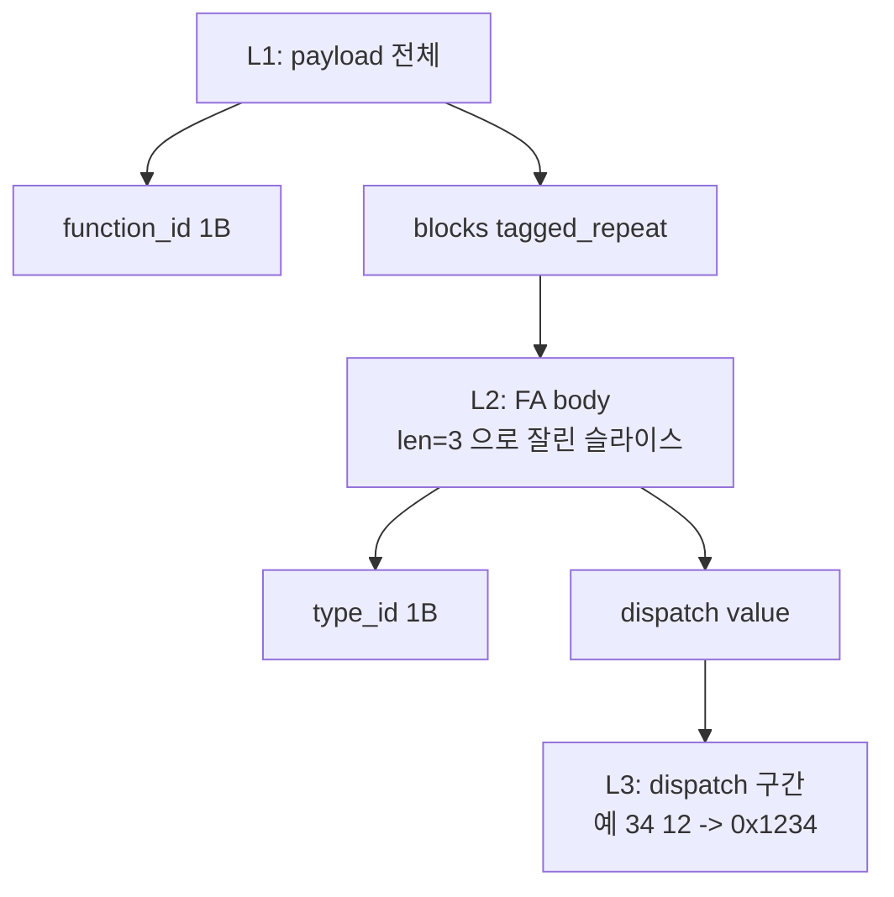

**규칙:** 하위 필드는 L2 밖(L1의 다른 FA 블록)으로 넘어가지 않는다.  
cursor는 **컨테이너마다 0에서 시작**, `boundEnd = len(슬라이스)`.

---

### 0.3 Cursor — 컨테이너 내부 읽기 위치

| 단계 | byteOff | bitOff | 설명 |
|------|---------|--------|------|
| 시작 | 0 | 0 | 컨테이너 첫 바이트 |
| uint8×3 읽은 후 | 3 | 0 | 3바이트 소비 |
| bit 필드 읽은 후 | 3 | 4 | 같은 바이트 안 |
| alignByte() 후 | 4 | 0 | 다음 바이트 정렬 |
| boundEnd | len(data) | — | **넘으면 에러** |

| 상태 | 의미 |
|------|------|
| `byteOff` | 컨테이너 시작(0) 기준 현재 바이트 |
| `bitOff` | 현재 바이트 내 비트 (0=LSB) |
| `maxByteOff` | 컨테이너 끝 (exclusive) |

---

### 0.4 Scope — 필드 간 공유 변수

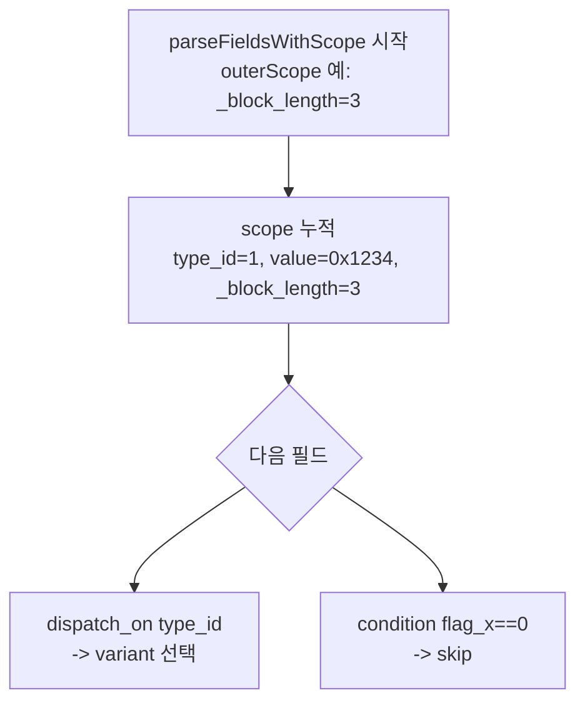

| scope 키 | 출처 |
|----------|------|
| 필드 `name` | 해당 필드 파싱 후 |
| `_block_length` | tagged가 body len 주입 |
| `dispatch_on` 대상 | choose/dispatch 분기에 사용 |

---

### 0.5 Tagged Block — flag | len | body (현재 엔진)

**한 블록 wire (표)** — `len` = **body만** (flag·len 바이트 제외)

| offset | hex | 역할 |
|--------|-----|------|
| +0 | `FA` | flag → variant 선택 |
| +1 | `03` | len = body 3B |
| +2..+4 | `01 34 12` | body → **컨테이너 L2** (3B) |

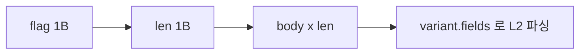

| type | 동작 | 결과 |
|------|------|------|
| `tagged_repeat` | 블록을 payload 끝까지 반복 | 배열 `[]` |
| `tagged_block` | 블록 1개만 | 객체 `{}` |

**반복 종료:** 등록되지 않은 flag → stop (`tagged_until: no_matching_flag`).


---

### 0.6 Combinator 3종 — 같은 payload 안에서의 역할

| combinator | 하는 일 | 비유 |
|------------|---------|------|
| `struct` | A → B → C 순서 고정 | 양식 칸 순서 |
| `dispatch` | scope 값으로 해석 분기 | type_id 보고 uint16/float/raw |
| `tagged_*` | flag\|len\|body 반복 또는 1회 | 꼬리표 붙은 상자 |

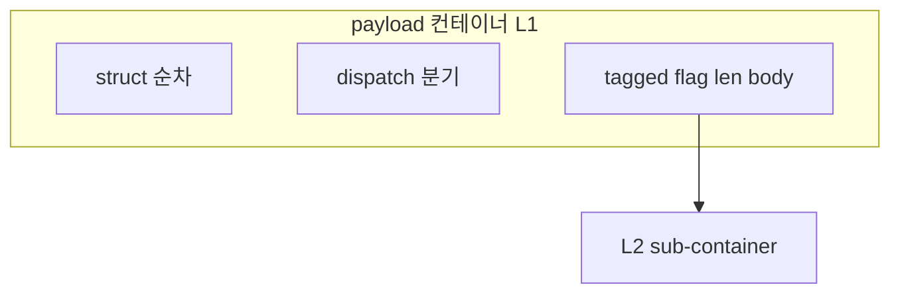

---

### 0.7 Length 모드 — 필드가 차지하는 바이트

컨테이너 크기 10B 가정:

| mode | 소비 | cursor |
|------|------|--------|
| `fixed` length=2 | 처음 2B | +2 |
| `remaining` | cursor ~ 끝 | 끝까지 |
| tagged `len` | (상위가 body 슬라이스 생성) | — |

---

### 0.8 LCP CF 예 — 영역 겹쳐 보기

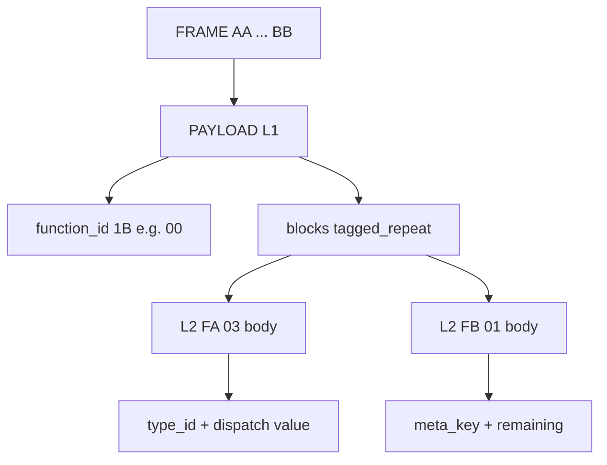

---

### 0.9 용어 한 줄 정리

| 용어 | 뜻 |
|------|-----|
| wire | 실제 수신 byte열 |
| frame_body | AA/BB 제거 후 envelope |
| payload | FID 스키마 파싱 구간 = 컨테이너 L1 |
| container | 파서에 넘긴 byte 슬라이스 (경계 상자) |
| cursor | container 안 읽기 위치 |
| scope | 앞 필드 값 + `_block_length` 공유 저장 |
| body | tagged len으로 잘린 구간 = 하위 container |
| boundEnd | container 끝. cursor 상한 |

---

### 0.10 ASCII 미지원 시

Mermaid 미리보기가 없으면 아래 **간단 Mermaid** 또는 §0.1 **표**를 사용한다.

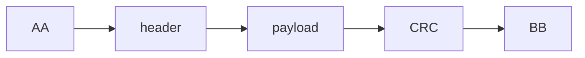

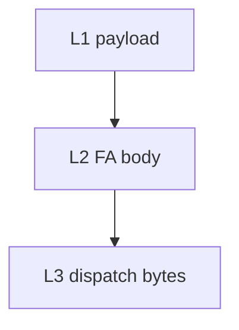

**Tagged one block (표)**

| offset | field |
|--------|-------|
| +0 | flag |
| +1 | len |
| +2.. | body = L2 container |

---

## 1. 파싱 모드

### 1.1 Frame + FID 모드 (순차 파싱)

`ProtocolSpec`에 `frame_def` 또는 `fid_payloads`가 있으면:

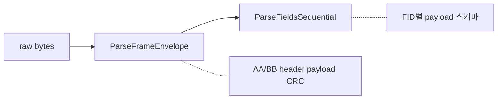

- Header 필드는 `frame_def.header[]` 순서대로 파싱한다.
- Header의 `payload_key_field`(기본 `fid`) 값으로 `fid_payloads`에서 payload 스키마를 선택한다.
- Payload는 해당 FID의 `fields[]`로 순차 파싱한다.

### 1.2 Raw / Absolute 모드 (절대 offset)

`frame_def`와 `fid_payloads`가 모두 없으면:

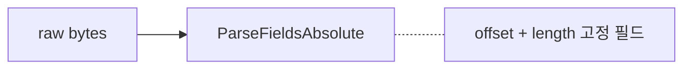

- 각 필드의 `offset`과 `length`로 직접 읽는다.
- Combinator(`struct`, `tagged_repeat` 등)는 **사용하지 않는다**.
- 비트 필드(`bit_length > 0`)만 offset 기준으로 지원한다.

---

## 2. 프레임 Envelope 규칙

### 2.1 Wire 구조


| 구간 | LCP 예 |
|------|--------|
| START | AA |
| HEADER | LN FID SEQ ATTR |
| PAYLOAD | CF/CD body |
| TAIL | CRC16 |
| END | BB |

- `start_byte`, `end_byte`: hex 문자열 (예: `"AA"`, `"BB"`). 첫/마지막 바이트와 일치하면 strip한다.
- `frame_body` = START와 END를 제외한 구간.

### 2.2 Header / Payload / Tail 분리

1. `header[]` 필드를 **순서대로** 파싱한다.
2. Payload 기본 끝 = `len(frame_body) - tail 크기`.
3. Header에 `length_field`(기본 `length`)가 있고, 그 값이 `header_end < length <= len(frame_body)`이면 **payload 끝 = length 오프셋**으로 덮어쓴다.
4. Payload = `frame_body[header_end : payload_end]`.
5. Tail = `frame_body` 끝에서 `tail[]` 필드 크기만큼.

### 2.3 CRC16

- 알고리즘: **CRC-16/CCITT** (poly `0x1021`, init `0xFFFF`).
- 검증 대상: `frame_body`에서 tail을 제외한 구간.
- `crc_position: "none"`이면 CRC 검증을 하지 않는다.

### 2.4 FID 라우팅

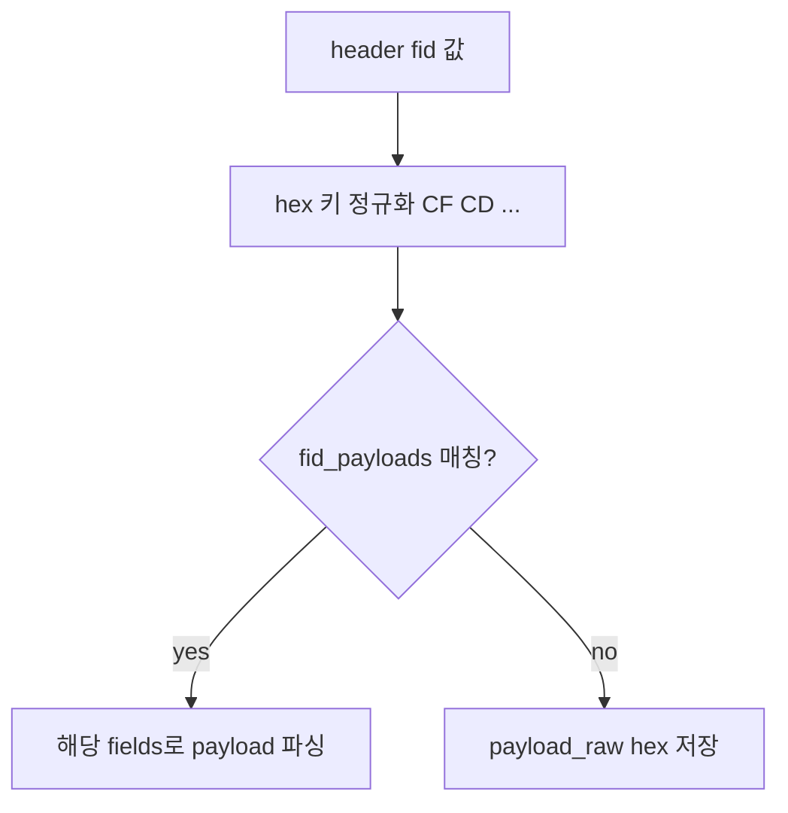

- `payload_key_field`(기본 `fid`) header 값을 hex 키로 정규화한다 (예: `0xCF` → `"CF"`).
- `fid_payloads[]`에서 `fid`가 일치하는 항목의 `fields`로 payload를 파싱한다.
- 매칭 스키마가 없으면 payload는 `payload_raw` hex 문자열로만 저장한다.

---

## 3. 순차 파싱 엔진

### 3.1 컨테이너 (Container)

**컨테이너** = 파서가 받은 byte 슬라이스. 상위 compositor가 경계를 정한다.

- 최상위 payload 파싱: 컨테이너 = 전체 payload.
- `tagged_*` body 파싱: 컨테이너 = `len` 바이트로 잘린 `blockData`.
- 커서는 컨테이너 끝(`boundEnd`)을 넘어 읽을 수 없다.

### 3.2 Cursor

```go
type parseCursor struct {
    byteOff    int  // 현재 바이트 오프셋
    bitOff     int  // 현재 바이트 내 비트 오프셋 (0–7)
    maxByteOff int  // 컨테이너 끝 (exclusive)
}
```

- 새 컨테이너마다 `maxByteOff = len(data)`로 초기화한다.
- 비트 필드 읽기 후 다음 바이트 필드 전에 `alignByte()`로 비트 정렬한다.

### 3.3 Scope

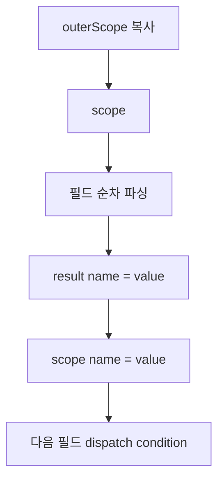

`parseFieldsWithScope(data, fields, outerScope)`:

1. `outerScope`를 복사해 scope를 만든다.
2. 필드를 순서대로 파싱한다.
3. `field.name`이 있으면 `result[name]`과 `scope[name]`에 저장한다.
4. 이후 필드의 `dispatch_on`, `condition`이 scope를 참조한다.

**Tagged body 파싱 시 scope에 주입되는 값:**

| 키 | 값 |
|----|-----|
| `_block_length` | tagged 블록의 `len` 바이트 값 (body 길이) |

---

## 4. FieldSpec 스키마

```json
{
  "name": "field_name",
  "type": "uint8",
  "length": 1,
  "endian": "little",
  "offset": 0,
  "unit": "",
  "enum_mapping": {},
  "fields": [],
  "flag": "FA",
  "condition": "other_field",
  "repeat": "until_end",
  "decoration": "{v/10}.{v%10}",
  "bit_offset": 0,
  "bit_length": 4,
  "length_mode": "remaining",
  "dispatch_on": "type_id",
  "dispatch_variants": { "01": [{ "...": "..." }] },
  "default_fields": [{ "...": "..." }],
  "tagged_layout": "flag_len_body",
  "tagged_until": "no_matching_flag"
}
```

| 속성 | 용도 |
|------|------|
| `name` | 결과 map 키. 비어 있고 `fields`만 있으면 하위 필드를 flatten |
| `type` | 필드/combinator 종류 (아래 §5) |
| `length` | 고정 길이 (바이트). 비트 필드일 때 컨테이너 바이트 수 |
| `endian` | `big` / `little`. 기본값 **`little`** |
| `offset` | Absolute 모드 전용 |
| `fields` | 중첩 필드 (struct, tagged variant, implicit struct) |
| `flag` | tagged variant 매칭 hex (예: `"FA"`) |
| `condition` | scope[condition]==0 이면 필드 skip |
| `repeat` | `"until_end"` → remaining과 동일 효과 (legacy) |
| `length_mode` | `"remaining"` → 컨테이너 끝까지 |
| `decoration` | 파싱 후 표시용 수식 (`{name}_display` 생성) |
| `bit_offset` | 컨테이너 바이트 내 시작 비트 (0–7). 없으면 cursor 연속 |
| `bit_length` | 읽을 비트 수. >0 이면 비트 필드 |
| `dispatch_on` | scope 필드명 (dispatch/dynamic) |
| `dispatch_variants` | hex 키 → fields[] |
| `default_fields` | variant 미매칭 fallback |
| `tagged_layout` | 현재 **`flag_len_body`만** 의미 있음 (관례) |
| `tagged_until` | `"no_matching_flag"` (기본): 미등록 flag에서 반복 종료 |

---

## 5. 필드 타입

### 5.1 스칼라 타입

| type | length | 결과 타입 | 비고 |
|------|--------|-----------|------|
| `uint8` | 1 (기본) | uint64 | |
| `int8` | 1 | int64 | |
| `uint16` | 2 | uint64 | endian 적용 |
| `int16` | 2 | int64 | endian 적용 |
| `uint32` | 4 | uint64 | endian 적용 |
| `int32` | 4 | int64 | endian 적용 |
| `float` | 4 | float64 | IEEE754 float32 |
| `ascii` | length | string | trailing `\x00` 제거 |
| `hex` | length | string | 대문자 hex |
| `raw` | length 또는 remaining | string (hex) | length=0 + remaining → 컨테이너 전체 |

- `length == 0`이고 raw/dynamic이 아니면 **1바이트**로 처리한다.
- 알 수 없는 type 문자열은 hex dump로 fallback한다.

### 5.2 Combinator 타입 (권장)

| type | 설명 | 결과 형태 |
|------|------|-----------|
| `struct` | `fields[]` 순차 파싱 | `map` |
| `dispatch` | `dispatch_on` 키로 variant 선택 | scalar 또는 map |
| `tagged_repeat` | flag\|len\|body 반복 | `[]map` |
| `tagged_block` | flag\|len\|body 1회 | `map` |

### 5.3 Legacy 타입 (호환)

| type | 실제 동작 |
|------|-----------|
| `function_args` | `tagged_repeat` (`tagged_until` 기본 `no_matching_flag`) |
| `func_result` | `tagged_block` |
| `dynamic` | `dispatch_on` + variants 있으면 dispatch, 없으면 remaining hex |

### 5.4 Implicit struct

`type`이 raw/dynamic이 아니고 `fields[]`가 있으면, type 없이도 중첩 struct처럼 파싱한다.

---

## 6. 필드 해석 우선순위

`parseOneField()`는 아래 순서로 판단한다.

```mermaid
flowchart TD
  A[parseOneField] --> B{condition == 0?}
  B -->|yes| SKIP[skip nil]
  B -->|no| C{remaining?}
  C -->|yes| REM[readRemainingField]
  C -->|no| D{type?}
  D -->|struct dispatch tagged_*| COMB[combinator]
  D -->|fields[]| NEST[nested struct]
  D -->|bit_length| BIT[readBitField]
  D -->|dynamic| DYN[dispatch or remaining]
  D -->|scalar| SCAL[readField]
```

### 6.1 Remaining 조건 (`fieldUsesRemaining`)

다음 중 하나면 **컨테이너 끝까지** 소비:

- `length_mode == "remaining"`
- `repeat == "until_end"`
- `type == "raw"` && `length == 0` && 비트 필드 아님

Remaining 동작:

- `ascii` → string (null trim)
- `hex`, `raw`, `dynamic` → hex string
- 그 외 type → 슬라이스 길이를 `length`로 설정 후 `readField()` 호출

---

## 7. Tagged Block Wire 형식 (`flag_len_body`)

### 7.1 Wire 레이아웃

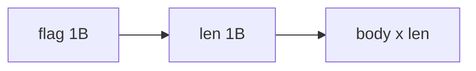

**중요: `len`은 body 길이만 나타낸다. flag와 len 바이트 자체는 포함하지 않는다.**

예: `FA 03 01 02 03`

| 바이트 | 의미 |
|--------|------|
| `FA` | flag |
| `03` | body 길이 = 3 |
| `01 02 03` | body (variant 스키마로 파싱) |

총 wire 크기 = 1 + 1 + 3 = **5바이트**.

### 7.2 `tagged_repeat`

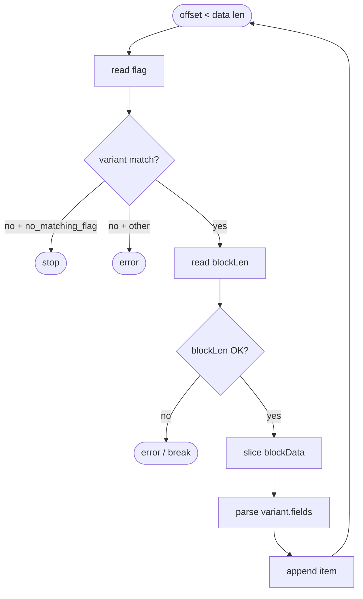

### 7.3 `tagged_block`

`tagged_repeat`와 동일하지만 **블록 1개만** 읽는다.

- 알려진 variant가 없고 body가 있으면 `{ flag, length, raw: hex }` 반환.
- `tagged_block`은 body 초과 시 body를 **잘라 읽음** (repeat와 달리 에러 대신 truncate).

### 7.4 Variant 매칭

- `fields[].flag` hex 문자열과 wire flag를 **대소문자 무시** 비교.
- `fields[].name`이 있으면 결과 `_name`에 저장.

---

## 8. Dispatch 규칙

### 8.1 Variant lookup

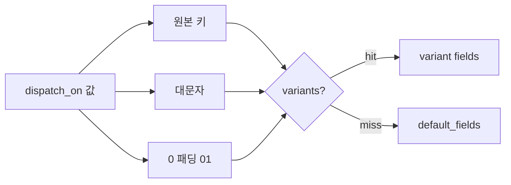

`dispatch_on` 필드 값을 hex 키로 정규화 후 `dispatch_variants`에서 검색:

- 원본 키
- 대문자 키
- 1자리 키 → `0` 패딩 (예: `1` → `"01"`)

### 8.2 Fallback

1. variant 없음 → `default_fields` 사용
2. `default_fields` 없음 → 컨테이너 끝까지 hex dump
3. `dispatch_on` scope에 없고 `default_fields` 있음 → default_fields 파싱
4. `dispatch_on` scope에 없고 default 없음 → **에러**

### 8.3 결과 unwrap

variant fields가 1개이고 이름이 있으면 `{ value: X }` 대신 **`X`만** 반환.  
sub map 키가 1개뿐이어도 동일하게 unwrap.

---

## 9. 비트 필드

- `bit_length > 0`이면 비트 필드.
- 읽기 방향: **LSB first** (byte 내 bit 0부터).
- `bit_offset` 지정: 해당 바이트의 고정 비트 위치에서 읽고, cursor는 `length` 바이트만큼 전진.
- `bit_offset` 미지정: cursor의 `byteOff:bitOff`에서 연속 읽기.
- `length` 미지정: `(bit_length + 7) / 8` 바이트를 컨테이너로 사용.

---

## 10. Decoration (표시용)

- 파싱 결과에 영향을 주지 **않는다**.
- 정수 필드 값 `v`에 대해 템플릿을 평가해 `{name}_display` 키를 추가한다.
- 표현식: `+`, `-`, `*`, `/`, `%`, 괄호, 리터럴, `v`.
- 예: `decoration: "{v/10}.{v%10}"`, `v=123` → `"12.3"`.

---

## 11. 숫자 / Endian 규칙

- Wire 값은 **raw binary byte**. hex `11` = decimal 17.
- `endian` 미지정 시 **little endian**.
- 1바이트 필드(`uint8`, `len` 바이트 등)는 endian 무관.

---

## 12. 에러 및 경계 처리

| 상황 | Backend | Frontend |
|------|---------|----------|
| 고정 필드가 컨테이너 초과 | error | error / null |
| tagged_repeat body 초과 | error | break (조용히 중단) |
| tagged_block body 초과 | truncate | slice (가능한 만큼) |
| CRC 불일치 | `valid: false`, error 메시지 | — |
| payload parse error | error 메시지, header는 유지 | 동일 |

---

## 13. 파싱 결과 구조

### ParseResult (Backend)

```json
{
  "fields": {
    "length": 16,
    "fid": "...",
    "seq_no": 1,
    "payload.function_id": 1,
    "payload.blocks": [ "..."]
  },
  "tree": {
    "start_byte": "AA",
    "length": 16,
    "blocks": [ "..." ],
    "tail_crc16": 12345
  },
  "fid": "CF",
  "seq_no": 1,
  "length": 16,
  "crc16": 12345,
  "valid": true
}
```

- `fields`: flat 키 (`payload.` 접두사 포함).
- `tree`: 중첩 구조 (payload 필드는 tree 루트에 merge).

---

## 14. LCP 기본 프리셋 (참고)

프리셋은 위 규칙의 **스키마 예시**이며, 별도 wire 규칙을 추가하지 않는다.

### Frame (`DefaultFrameDef`)

| 구간 | 필드 | 크기/endian |
|------|------|-------------|
| START | AA | 1B |
| header | length | 2B BE |
| header | fid | 1B |
| header | seq_no | 2B BE |
| header | attr | 1B |
| payload | (FID별) | 가변 |
| tail | crc16 | 2B BE |
| END | BB | 1B |

### CF Payload (현재 프리셋)

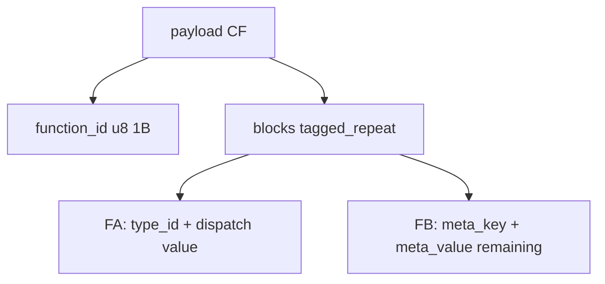

> **참고:** 프로토콜 스펙상 `function_id`는 **1바이트**. FC 블록 body 안에도 동일. 아래 §14 CD의 `function_id`도 u8.

### CD Payload (현재 프리셋)

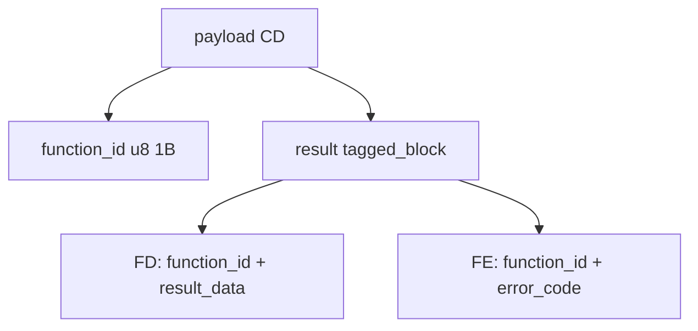

---

## 15. 설계상 제약 (현재 미지원)

다음은 **현재 구현에 없으며**, 스키마만으로 표현할 수 없다.

| 기능 | 설명 |
|------|------|
| `tagged_len_mode: self` | len이 flag~블록 끝 전체를 포함하는 wire (FA self-inclusive len) |
| `length_expr` | `block_len - 2` 같은 수식 기반 필드 길이 |
| `tagged_header_size` | self-inclusive 블록 내부 skip |
| 다중 length 필드 크기 | tagged len은 항상 **1바이트** |

self-inclusive TLV (len = FA+len+value 전체)를 파싱하려면 엔진 확장 또는 wire를 body-only len으로 맞춰야 한다.

---

## 16. 요약

```mermaid
mindmap
  root((Sentinel parsing))
    FrameDef
      envelope
      CRC
      FID routing
    FieldSpec
      cursor
      scope
      container
    Combinators
      struct
      dispatch
      tagged_repeat
      tagged_block
    Length
      fixed
      remaining
    Tagged
      body-only len
```

프로토콜을 추가할 때는 wire 규칙을 FieldSpec DSL로 분해하고, **tagged len이 body-only라는 전제**와 맞는지 반드시 확인한다.

---

## 17. v2 열린 파싱 구조 (설계)

v1의 `tagged_*` 고정 한계를 넘어 **frame / repeat / choose / expr / len_field / wire program** 으로 조합하는 v2 DSL 설계:

→ **[parsing-dsl.md §3 가변 길이](parsing-dsl.md)** · 전체: [parsing-dsl.md](parsing-dsl.md)
