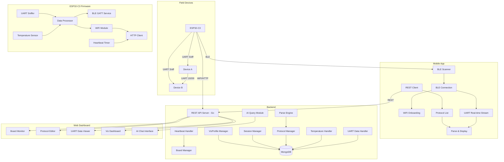
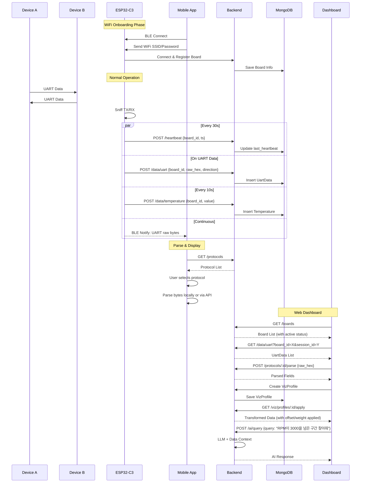
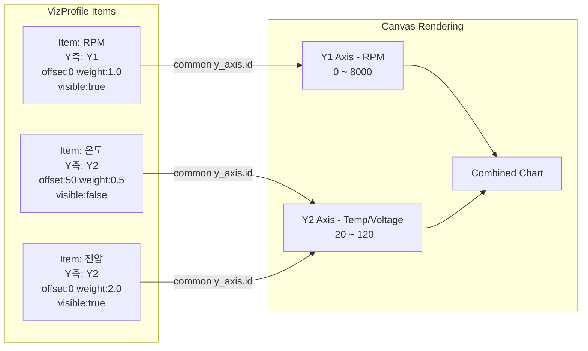

# Sentinel — UART 데이터 수집 및 분석 시스템

## 1. 프로젝트 개요

ESP32-C3 기반 UART 스니퍼 시스템. 두 디바이스 간 19200bps UART 통신을 도청하여 데이터를 수집하고, Go 백엔드 + MongoDB에 저장하며, React 웹 대시보드에서 프로토콜 명세 기반 파싱 및 AI 분석을 제공한다.

## 2. 시스템 구성

| 구성 요소 | 기술 스택 | 역할 |
|---|---|---|
| ESP32-C3 | C (ESP-IDF / Arduino) | UART 스니핑, 온도 센싱, BLE 스트리밍, WiFi 전송, Heartbeat |
| 모바일 앱 | Flutter | BLE 연결, WiFi 온보딩, 실시간 데이터 확인, 프로토콜 명세 선택 → 파싱 결과 표시 |
| 백엔드 | Go + MongoDB | REST API, 데이터 저장/조회, 프로토콜 파싱 엔진, AI 쿼리 |
| 대시보드 | React + TypeScript | 보드 관리, 프로토콜 명세 CRUD, 데이터 뷰어, 시각화, AI 인터페이스 |

## 3. 기능 요구사항

### 3.1 ESP32-C3 펌웨어
- **UART 스니핑**: 19200bps, TX/RX 양방향 데이터 캡처
- **온도 센싱**: 내부 또는 외부 온도 센서 리딩
- **BLE**:
  - WiFi 온보딩 서비스
  - 실시간 UART 데이터 스트리밍 (GATT characteristic)
- **WiFi 통신**: 백엔드로 UART 데이터, 온도, Heartbeat 전송 (HTTP)
- **Heartbeat**: 주기적 전송으로 활성 상태 알림

### 3.2 모바일 앱
- BLE 스캔 및 ESP32-C3 연결
- BLE 기반 WiFi 온보딩 (SSID/Password 설정)
- 실시간 UART 데이터 스트리밍 표시
- REST API로 프로토콜 명세 목록 조회 → 선택 → 파싱 결과 표시
- 온도 표시

### 3.3 백엔드
- **보드 관리**: 등록, 목록, 활성 상태 (Heartbeat 기반)
- **데이터 수집**: UART raw bytes, 온도 데이터, Heartbeat
- **세션 관리**: 데이터 구간 분할 (수동/자동, 타임갭/패턴 기반)
- **프로토콜 명세**: CRUD, 버전 관리
- **데이터 파싱**: 명세 기반 raw bytes → 필드 변환
- **시각화 프로필**: 멀티 Y축, Offset, Weight, Visibility 관리
- **AI 분석**: 자연어 질의 → 데이터 탐색 및 추론

### 3.4 웹 대시보드
- 보드 목록 및 활성 상태 모니터링
- 프로토콜 명세 에디터
- UART 데이터 뷰어 (raw hex + 파싱 결과)
- 세션 관리 UI
- 시각화 대시보드:
  - 항목별 Y축 분리/공유
  - Offset/Weight 조절 (화면 내 동시 표현)
  - Visibility 토글
  - 프로필 저장/로드
- AI 쿼리 인터페이스 (자연어 채팅)

## 4. 데이터 모델

### 4.1 Board
```
board_id, name, mac_address, firmware_version,
last_heartbeat (timestamp), is_active (bool),
created_at, updated_at
```

### 4.2 ProtocolSpec
```
id, name, version, description,
fields: [
  { name, offset (bytes), length (bytes),
    type (uint8/int16/float/ascii/enum),
    unit, enum_mapping: {key: value},
    endian (big/little) }
]
```

### 4.3 UartData
```
id, board_id, session_id, timestamp,
raw_hex (string), parsed_fields [{}],
direction (TX/RX)
```

### 4.4 Session
```
id, board_id, name, description,
start_time, end_time, tags [],
auto_split_rule: { type: timegap|pattern, params: {} }
```

### 4.5 Temperature
```
id, board_id, timestamp, value_celsius
```

### 4.6 VizProfile
```
id, name, description,
board_id, session_ids [],
time_range: { start, end },
items: [{
  id, label, color, visible,
  field_ref: { protocol_id, field_name },
  chart_type: line|bar|scatter,
  y_axis: { id, label, unit, min, max },
  offset (number), weight (number)
}]
```

## 5. 시스템 아키텍처 다이어그램



## 6. 데이터 흐름 다이어그램



## 7. 시각화 개념도



## 8. API 엔드포인트

### 보드 관리
| Method | Path | Description |
|---|---|---|
| POST | `/api/v1/boards/register` | 보드 등록 |
| GET | `/api/v1/boards` | 보드 목록 (활성 상태 포함) |
| GET | `/api/v1/boards/:id` | 보드 상세 |
| PUT | `/api/v1/boards/:id` | 보드 정보 수정 |
| POST | `/api/v1/heartbeat` | Heartbeat 수신 |

### 데이터 수집
| Method | Path | Description |
|---|---|---|
| POST | `/api/v1/data/uart` | UART bytes 수신 |
| POST | `/api/v1/data/uart/batch` | 배치 수신 |
| POST | `/api/v1/data/temperature` | 온도 수신 |

### 데이터 조회
| Method | Path | Description |
|---|---|---|
| GET | `/api/v1/data/uart` | UART 데이터 조회 (board_id, session_id, 시간 필터) |
| GET | `/api/v1/data/temperature` | 온도 데이터 조회 |

### 세션 관리
| Method | Path | Description |
|---|---|---|
| POST | `/api/v1/sessions` | 세션 생성 |
| PUT | `/api/v1/sessions/:id` | 세션 수정 |
| GET | `/api/v1/sessions` | 세션 목록 |
| DELETE | `/api/v1/sessions/:id` | 세션 삭제 |
| POST | `/api/v1/sessions/auto-split` | 자동 구간 분할 |

### 프로토콜 명세
| Method | Path | Description |
|---|---|---|
| CRUD | `/api/v1/protocols` | 프로토콜 명세 관리 |
| POST | `/api/v1/protocols/:id/parse` | 명세 기반 파싱 |

### 시각화
| Method | Path | Description |
|---|---|---|
| CRUD | `/api/v1/viz/profiles` | 시각화 프로필 관리 |
| POST | `/api/v1/viz/profiles/:id/apply` | 프로필 적용 데이터 조회 |
| POST | `/api/v1/viz/query` | 시각화용 집계/변환 쿼리 |

### AI
| Method | Path | Description |
|---|---|---|
| POST | `/api/v1/ai/query` | 자연어 질의 |

## 9. 시각화 핵심 기능

| 기능 | 설명 |
|---|---|
| 멀티 Y축 | `y_axis.id`가 다른 항목은 각각 독립된 Y축 (좌/우 배치) |
| Offset | 각 항목별 `offset` 값만큼 데이터를 Y축 방향 이동 → 중첩 비교 가능 |
| Weight | 각 항목별 `weight` 배율로 데이터 증폭/감소 → 미세 신호 확대 |
| Visibility toggle | `visible` 필드로 각 항목 실시간 표시/숨김 |
| Y축 공유 | 같은 `y_axis.id`를 가진 항목들은 동일 Y축 공유 |
