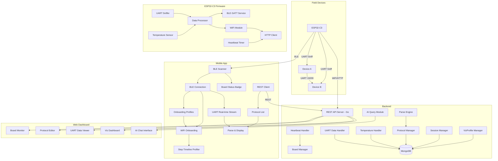
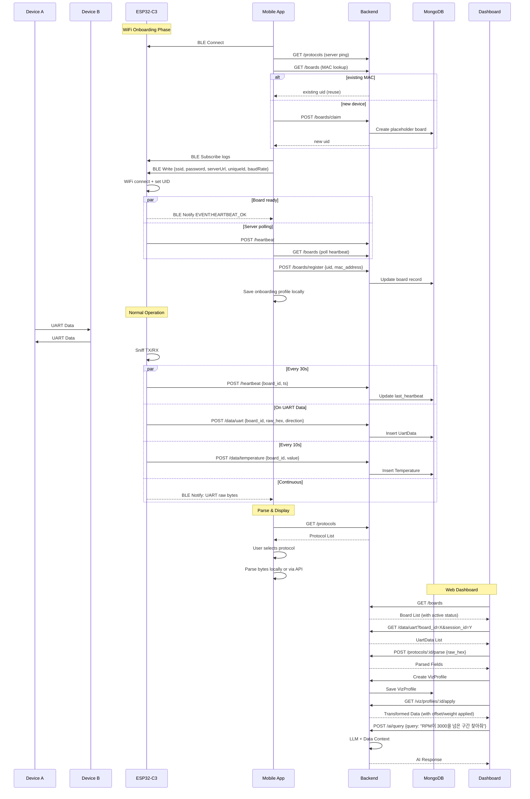
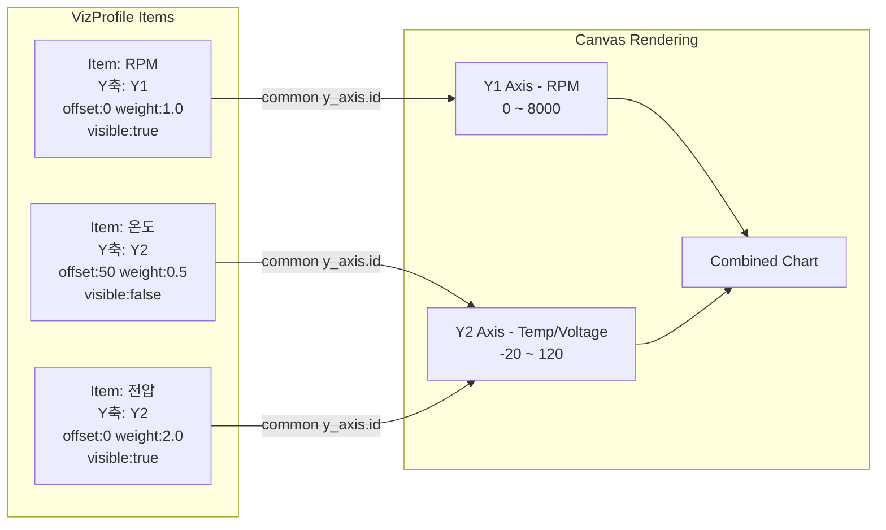

# Sentinel — UART 데이터 수집 및 분석 시스템

## 1. 프로젝트 개요

ESP32-C3 기반 UART 스니퍼 시스템. 두 디바이스 간 19200bps UART 통신을 도청하여 데이터를 수집하고, Go 백엔드 + MongoDB에 저장하며, React 웹 대시보드에서 프로토콜 명세 기반 파싱 및 AI 분석을 제공한다.

## 2. 시스템 구성

| 구성 요소 | 기술 스택 | 역할 |
|---|---|---|
| ESP32-C3 | C (ESP-IDF / Arduino) | UART 스니핑, 온도 센싱, BLE 스트리밍, WiFi 전송, Heartbeat |
| 모바일 앱 | Flutter | BLE 스캔·연결, WiFi 온보딩, 온보딩 프로파일 관리, 보드 상태 표시, 실시간 UART, 프로토콜 파싱 |
| 백엔드 | Go + MongoDB | REST API, 데이터 저장/조회, 프로토콜 파싱 엔진, AI 쿼리 |
| 대시보드 | React + TypeScript | 보드 관리, 프로토콜 명세 CRUD, 데이터 뷰어, 시각화, AI 인터페이스 |

## 3. 기능 요구사항

### 3.1 ESP32-C3 펌웨어
- **UART 스니핑**: 기본 19200bps (온보딩 시 baud rate 설정 가능), TX/RX 양방향 데이터 캡처
- **온도 센싱**: 내부 또는 외부 온도 센서 리딩
- **BLE (NimBLE)**:
  - Nordic UART Service (NUS) UUID 사용 (`6e400001/2/3...`, nexio 호환)
  - WiFi 온보딩: GATT Write characteristic으로 JSON 설정 수신
  - 실시간 UART 데이터 스트리밍 (GATT Notify characteristic)
  - BLE 로그 Notify (온보딩 진행 이벤트: `EVENT:HEARTBEAT_OK` 등)
  - Advertising:
    - 디바이스 이름: `Sentinel-XXXX` (4자리 UID)
    - Manufacturer Data (Company ID `0x02E5`): 상태 플래그 + UID
    - 상태 플래그: `CFG(0x08)` UID/설정 수신, `WIFI(0x04)` WiFi 연결, `SVR(0x02)` 서버 Heartbeat OK
- **WiFi 통신**: 백엔드로 UART 데이터, 온도, Heartbeat 전송 (HTTP)
- **Heartbeat**: 주기적 전송으로 활성 상태 알림
- **재온보딩**: 동일 SSID로 이미 연결된 경우 재연결 없이 Heartbeat 재시도

### 3.2 모바일 앱

#### 3.2.1 BLE 스캔 및 보드 상태
- `Sentinel-*` 접두사 디바이스 필터링, RSSI 기준 정렬
- BLE Advertising + 서버 레지스트리(`GET /api/v1/boards`)를 조합해 보드 상태 표시:

| 상태 | 조건 |
|---|---|
| Unregistered | UID 없음, 미등록 |
| Configured | UID/설정 있으나 WiFi 미연결 |
| Connecting | BLE 플래그 기반 연결 진행 중 |
| Registering | WiFi 연결됨, 서버 Heartbeat 대기 |
| Online | 서버 Heartbeat 2분 이내 |
| Offline | 등록됨, Heartbeat 만료 |

#### 3.2.2 WiFi 온보딩 플로우
1. BLE 연결
2. 서버 연결 확인 (`GET /api/v1/protocols` ping)
3. UID 확보: MAC 기준 기존 최소 UID 재사용 → 없으면 `POST /api/v1/boards/claim`
4. BLE 로그 구독 (NUS Notify)
5. BLE로 설정 전송 (JSON: `ssid`, `password`, `serverUrl`, `uniqueId`, `baudRate`)
6. 보드 준비 대기: BLE `EVENT:HEARTBEAT_OK` + 서버 Heartbeat 폴링 (최대 90초)
7. `POST /api/v1/boards/register` 로 MAC·UID 등록
8. 스캔 화면 복귀 + 등록 완료 토스트

#### 3.2.3 온보딩 설정 프로파일 (로컬)
- WiFi SSID/Password, 서버 URL, baud rate를 **이름 있는 프로파일**로 저장 (SharedPreferences)
- Control 탭 UI:
  - 가로 스크롤 프로파일 카드 (선택 / 이름 변경 / 삭제 / New 추가)
  - 설정 폼 그룹: Network / Device / Server
  - 필드 변경 시 Unsaved changes 배너 → Save / Update
- 온보딩 성공 시 현재 설정을 프로파일에 자동 반영
- 마지막 선택 프로파일 ID 기억
- 기존 `wifi_profiles` 데이터는 최초 실행 시 자동 마이그레이션

#### 3.2.4 온보딩 Step Timeline (프로파일링)
- 온보딩 단계별 소요 시간(ms) 측정 및 시각화
- 측정 단계: Server reachable → UID claimed → BLE subscribed → Config sent → Board ready → Registered
- 실패 단계·메모 표시, 총 소요 시간 표시

#### 3.2.5 기타
- **DeviceScreen** 탭: Control (온보딩) / Data (UART·프로토콜) / Monitor
- **AppToast**: success / error / info 통일 스타일 알림
- REST API로 프로토콜 명세 목록 조회 → 선택 → 파싱 결과 표시
- 실시간 UART 데이터 스트리밍 표시
- 온도 표시

### 3.3 백엔드
- **보드 관리**:
  - 등록 (`/boards/register`), 목록, 활성 상태 (Heartbeat 기반)
  - UID Claim (`/boards/claim`): MAC 제공 시 기존 UID 재사용 (`reused: true`), 신규 시 placeholder 보드 생성
  - 4자리 순차 UID (`0001`, `0002`, …)
- **데이터 수집**: UART raw bytes, 온도 데이터, Heartbeat
- **세션 관리**: 데이터 구간 분할 (수동/자동, 타임갭/패턴 기반)
- **프로토콜 명세**: CRUD, 버전 관리
- **데이터 파싱**: 명세 기반 raw bytes → 필드 변환
- **시각화 프로필**: 멀티 Y축, Offset, Weight, Visibility 관리
- **AI 분석**: 자연어 질의 → 데이터 탐색 및 추론

### 3.4 웹 대시보드
- 보드 목록 및 활성 상태 모니터링
- 프로토콜 명세 에디터
- UART 데이터 뷰어 (raw hex + 파싱 결과)
- 세션 관리 UI
- 시각화 대시보드:
  - 항목별 Y축 분리/공유
  - Offset/Weight 조절 (화면 내 동시 표현)
  - Visibility 토글
  - 프로필 저장/로드
- AI 쿼리 인터페이스 (자연어 채팅)

## 4. 데이터 모델

### 4.1 Board
```
uid (4-digit string), board_id (uuid), name, mac_address, firmware_version,
last_heartbeat (timestamp), is_active (bool),
created_at, updated_at
```

### 4.2 OnboardingProfile (모바일 로컬)
```
id, name, ssid, password, serverUrl, baudRate, updatedAt
```
- 저장 위치: SharedPreferences (`onboarding_profiles`)
- 서버 동기화 없음 (디바이스별 온보딩 프리셋)

### 4.3 ProtocolSpec
```
id, name, version, description,
fields: [
  { name, offset (bytes), length (bytes),
    type (uint8/int16/float/ascii/enum),
    unit, enum_mapping: {key: value},
    endian (big/little) }
]
```

### 4.4 UartData
```
id, board_id, session_id, timestamp,
raw_hex (string), parsed_fields [{}],
direction (TX/RX)
```

### 4.5 Session
```
id, board_id, name, description,
start_time, end_time, tags [],
auto_split_rule: { type: timegap|pattern, params: {} }
```

### 4.6 Temperature
```
id, board_id, timestamp, value_celsius
```

### 4.7 VizProfile
```
id, name, description,
board_id, session_ids [],
time_range: { start, end },
items: [{
  id, label, color, visible,
  field_ref: { protocol_id, field_name },
  chart_type: line|bar|scatter,
  y_axis: { id, label, unit, min, max },
  offset (number), weight (number)
}]
```

## 5. 시스템 아키텍처 다이어그램



## 6. 데이터 흐름 다이어그램



## 7. 시각화 개념도



## 8. API 엔드포인트

### 보드 관리
| Method | Path | Description |
|---|---|---|
| POST | `/api/v1/boards/claim` | UID 발급 (MAC 있으면 기존 UID 재사용) |
| POST | `/api/v1/boards/register` | 보드 등록 (UID·MAC 업데이트) |
| GET | `/api/v1/boards` | 보드 목록 (활성 상태 포함) |
| GET | `/api/v1/boards/:id` | 보드 상세 |
| PUT | `/api/v1/boards/:id` | 보드 정보 수정 |
| POST | `/api/v1/heartbeat` | Heartbeat 수신 |

### 데이터 수집
| Method | Path | Description |
|---|---|---|
| POST | `/api/v1/data/uart` | UART bytes 수신 |
| POST | `/api/v1/data/uart/batch` | 배치 수신 |
| POST | `/api/v1/data/temperature` | 온도 수신 |

### 데이터 조회
| Method | Path | Description |
|---|---|---|
| GET | `/api/v1/data/uart` | UART 데이터 조회 (board_id, session_id, 시간 필터) |
| GET | `/api/v1/data/temperature` | 온도 데이터 조회 |

### 세션 관리
| Method | Path | Description |
|---|---|---|
| POST | `/api/v1/sessions` | 세션 생성 |
| PUT | `/api/v1/sessions/:id` | 세션 수정 |
| GET | `/api/v1/sessions` | 세션 목록 |
| DELETE | `/api/v1/sessions/:id` | 세션 삭제 |
| POST | `/api/v1/sessions/auto-split` | 자동 구간 분할 |

### 프로토콜 명세
| Method | Path | Description |
|---|---|---|
| CRUD | `/api/v1/protocols` | 프로토콜 명세 관리 |
| POST | `/api/v1/protocols/:id/parse` | 명세 기반 파싱 |

### 시각화
| Method | Path | Description |
|---|---|---|
| CRUD | `/api/v1/viz/profiles` | 시각화 프로필 관리 |
| POST | `/api/v1/viz/profiles/:id/apply` | 프로필 적용 데이터 조회 |
| POST | `/api/v1/viz/query` | 시각화용 집계/변환 쿼리 |

### AI
| Method | Path | Description |
|---|---|---|
| POST | `/api/v1/ai/query` | 자연어 질의 |

## 9. 시각화 핵심 기능

| 기능 | 설명 |
|---|---|
| 멀티 Y축 | `y_axis.id`가 다른 항목은 각각 독립된 Y축 (좌/우 배치) |
| Offset | 각 항목별 `offset` 값만큼 데이터를 Y축 방향 이동 → 중첩 비교 가능 |
| Weight | 각 항목별 `weight` 배율로 데이터 증폭/감소 → 미세 신호 확대 |
| Visibility toggle | `visible` 필드로 각 항목 실시간 표시/숨김 |
| Y축 공유 | 같은 `y_axis.id`를 가진 항목들은 동일 Y축 공유 |

## 10. 온보딩 BLE 프로토콜

### 10.1 GATT 서비스 (NUS)
| UUID | 역할 |
|---|---|
| `6e400001-...` | UART Service |
| `6e400002-...` | Notify (로그 / UART 데이터) |
| `6e400003-...` | Write (온보딩 설정 JSON) |
| `6e400004-...` | Read (WiFi MAC, 예약) |

### 10.2 온보딩 Write 페이로드 (JSON)
```json
{
  "ssid": "WiFi 이름",
  "password": "WiFi 비밀번호",
  "serverUrl": "http://192.168.0.9:5050",
  "uniqueId": "0042",
  "baudRate": 19200
}
```

### 10.3 Manufacturer Data (`0x02E5`)
```
[flags: 1 byte][uid: ASCII, max 4 bytes]
```
- flags: `CFG | WIFI | SVR` 비트 조합
- uid: 숫자 UID 문자열 (예: `"0042"`)

### 10.4 알려진 제약
- iOS BLE `remoteId`는 WiFi MAC과 다를 수 있음 → 서버 MAC lookup은 BLE remoteId 기준
- 펌웨어 Heartbeat `board_id`는 WiFi MAC 기반 UID 사용
- BLE 상태 플래그 변경 후 펌웨어 재플래시 필요
